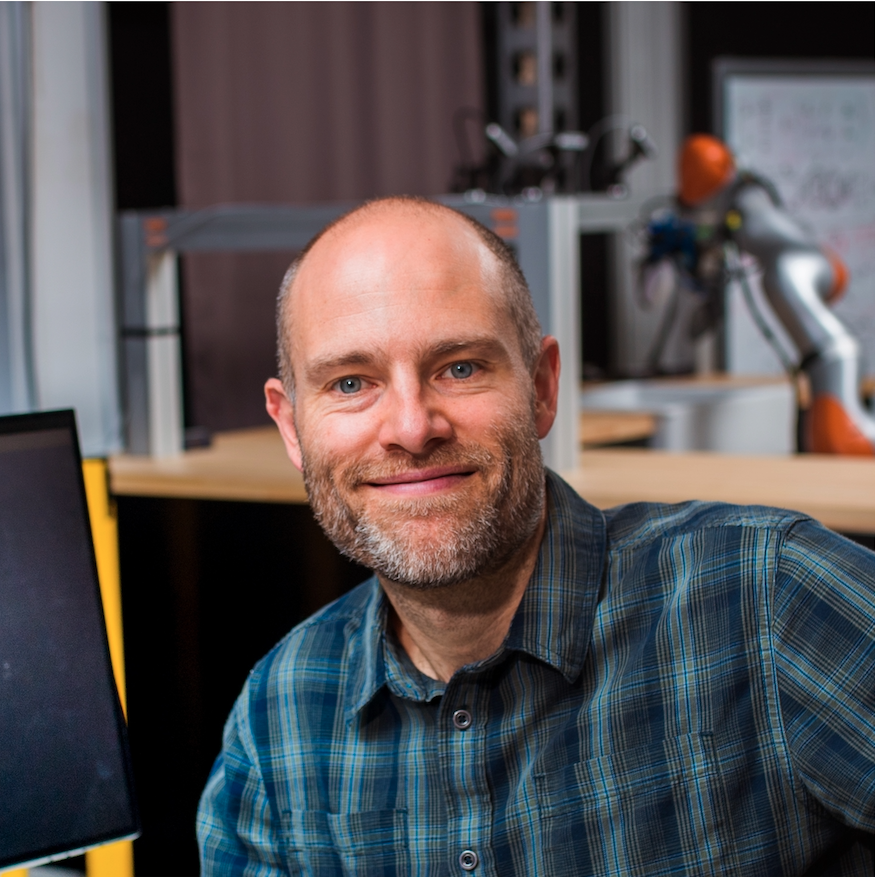
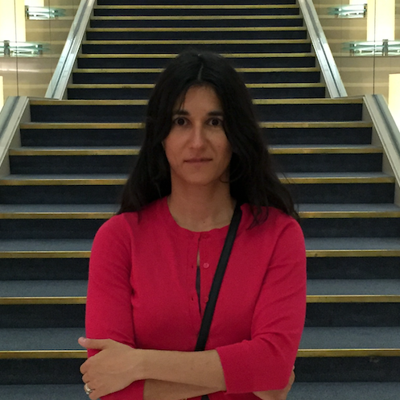
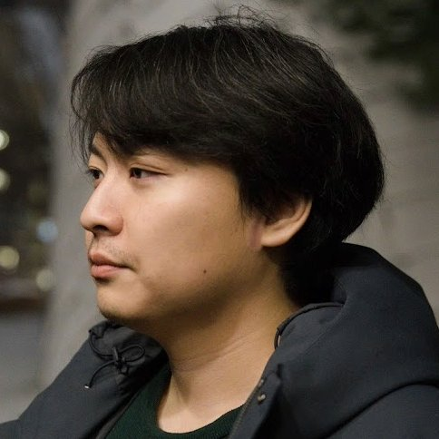
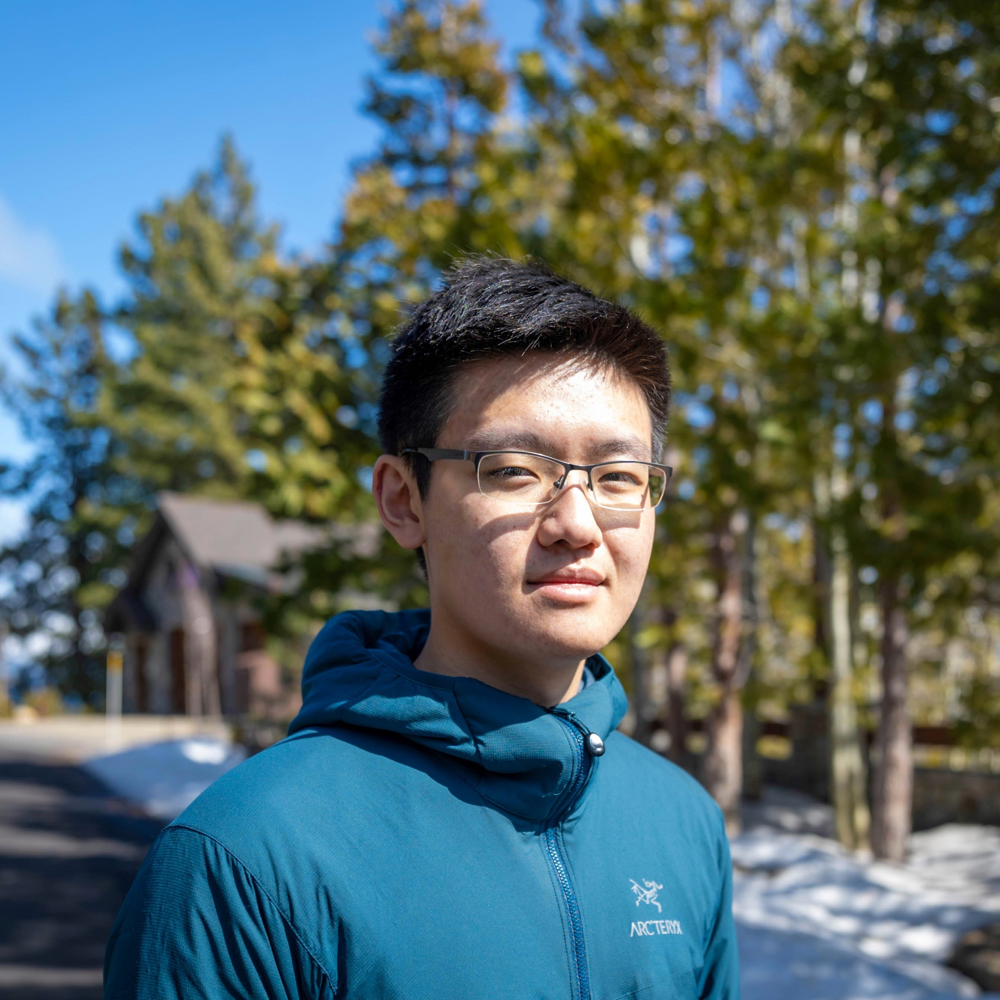

---
# Feel free to add content and custom Front Matter to this file.
# To modify the layout, see https://jekyllrb.com/docs/themes/#overriding-theme-defaults

permalink: /
title: Home
workshop_title: Learning Meets Model-Based Methods for Contact-Rich Manipulation
layout: home
conference_title: ICRA 2025, Atlanta, USA
workshop_date: Monday, May 19th, 2025
workshop_length: Half-day workshop
---

This workshop explores the challenge of enabling robots to autonomously handle complex, contact-rich interactions. Traditionally, model-based methods have provided structured frameworks for planning and control, while recent learning-based methods have leveraged large datasets to achieve new capabilities. However, these methods often overlook the structured insights that model-based approaches offer. As robotics continues to evolve, there is a growing need to integrate the adaptability of learning-based techniques with the precision and efficiency of model-based strategies.

The workshop will bring together researchers to debate the future of dexterous robot manipulation and the roles of model-based optimization versus data-driven approaches. Key questions to be explored include:

- Is a structured approach still necessary for future robots, or can expressive neural networks alone suffice?
- What role will model-based optimization play in the future of dexterous robot manipulation?
- How can we effectively use limited data to train robots, and should we impose more structure to enhance learning?
- Will the development of comprehensive robot datasets remain an open challenge?
- Can the integration of model-based and learning-based methods lead to more robust and versatile robotic systems?

The workshop will feature talks, presentations, and heated debates to evaluate how these approaches can be combined to enhance robotic autonomy and efficiency in contact-rich environments. Participants will critically examine whether traditional robotics techniques remain relevant in a field increasingly dominated by machine learning and discuss the skills and strategies needed to develop the next generation of intelligent robots.

&nbsp;
&nbsp;

### Call for papers

Important Dates:

- Submission portal opens: TBA
- Paper submission deadline: TBA 
- Notification of acceptance: TBA 
- Workshop date: 2025/05/19

See our [Call for papers page](/callforpapers) for more details.
Submission will be accepted through [OpenReview]().

&nbsp;
&nbsp;

### Speakers and Panelists
&nbsp;

    

        <figure>
            
            <figcaption><b>Russ Tedrake</b> MIT</figcaption>
        </figure>
    

    

        <figure>
            
            <figcaption><b>Ken Goldberg</b> UC Berkeley</figcaption>
        </figure>
    

    

        <figure>
            
            <figcaption><b>Kris Hauser</b> University of Illinois Urbana-Champaign</figcaption>
        </figure>
    

    

        <figure>
            
            <figcaption><b>Danica Kragic</b> Royal Institute of Technology (KTH)</figcaption>
        </figure>
    

    

        <figure>
            
            <figcaption><b>Katerina Fragkiadaki</b> Carnegie Mellon University</figcaption>
        </figure>
    

&nbsp;

### Debate Moderator
&nbsp;

    

        <figure>
            
            <figcaption><b>Yunzhu Li</b> Columbia University</figcaption>
        </figure>
    

### Organizers
&nbsp;

    

        <figure>
            
            <figcaption><b>Haonan Chen</b> University of Illinois Urbana-Champaign</figcaption>
        </figure>
    

    

        <figure>
             
            <figcaption><b>Lujie Yang</b> Massachusetts Institute of Technology</figcaption>
        </figure>
    

    

        <figure>
            
            <figcaption><b>Shaoxiong Yao</b> University of Illinois Urbana-Champaign</figcaption>
        </figure>
    

    

        <figure>
            
            <figcaption><b>Jiayuan Mao</b> Massachusetts Institute of Technology</figcaption>
        </figure>
    

    

        <figure>
            
            <figcaption><b>Hyung Ju Terry Suh</b> Massachusetts Institute of Technology</figcaption>
        </figure>
    

    

        <figure>
            
            <figcaption><b>Yifeng Zhu</b> University of Texas at Austin</figcaption>
        </figure>
    

    

        <figure>
            
            <figcaption><b>Letian (Max) Fu</b> University of California, Berkeley</figcaption>
        </figure>
    

    

        <figure>
            
            <figcaption><b>Wei-Cheng Huang</b> University of Illinois Urbana-Champaign</figcaption>
        </figure>
    

    

        <figure>
            
            <figcaption><b>Katherine Driggs-Campbell</b> University of Illinois Urbana-Champaign</figcaption>
        </figure>
    

<!-- ### Advisor

    

        <figure>
        
        <figcaption><b>Pieter Abbeel</b> UC Berkeley</figcaption>
        </figure>
    

 -->
